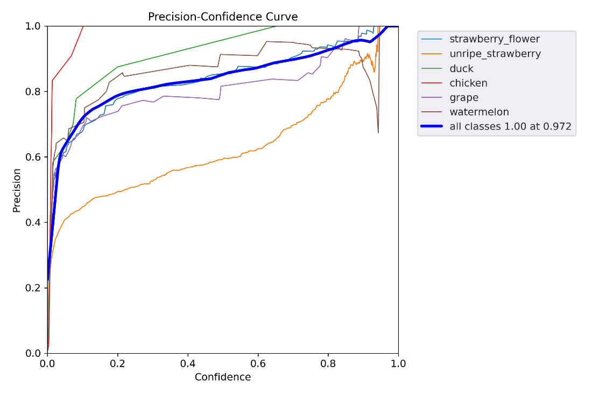
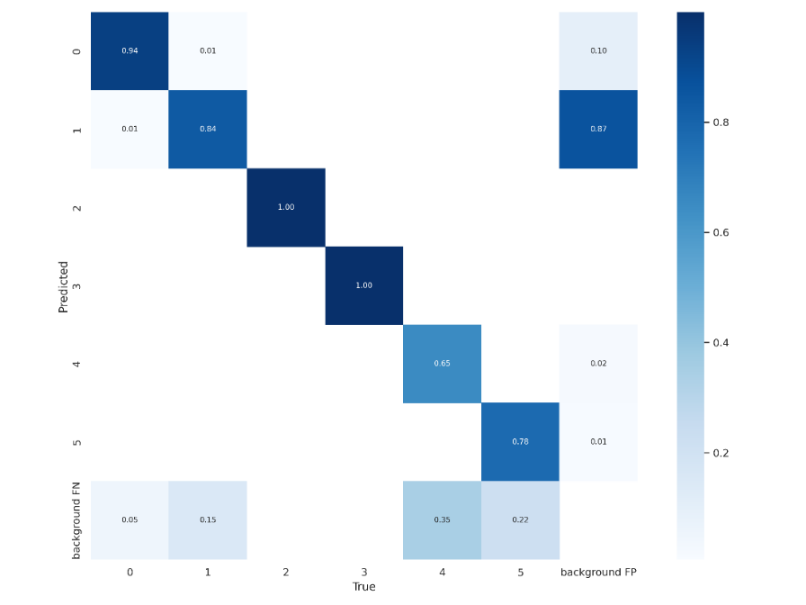

# OBJECT DETECTION 

## Artificial intelligence project 

| **Group member** | **Responsibilities** |
| --- | --- |
| Pruetikorn Chirattitikarn | Gathering dataset and writing a report |
| Princewell Baffour Awuah | Model training and streamlit app |
| George Mynarskyi | Labeling dataset, git and streamlit app |

*Academic year 2022-2023*

## Table of Contents <!-- omit in toc -->

- [Introduction](#intro)
- [Method](#method)
- [Model training and results](#training)
	- [Google VertexAI](#vertexai)
	- [YOLO v5](#yolo5)
	- [YOLO v7](#yolo7)
- [Challenges](#challenges)
- [Result and conclusions](#result)
- [Website](#site)

## Introduction

Object Detection is an artificial intelligence model. In other words, it is a computer technology that is applied in computer vision and image processing. It is used to detect entity of objects and classify them by comparing the pattern of features. It has been used in many applications, for example, face detection, tracking objects etc. In our project, we created an object detection model which can detect 6 objects: strawberry flower, unripe strawberry, duck, chicken, watermelon, and grapes.  

There are many tools that are utilized for training object detection models. For example, [YOLO](https://github.com/ultralytics/yolov5) (You Only Look Once) is a real-time object detection model that is specialized in time and accuracy, which is practically higher than the others. It is an open-source software that is freely available and widely used. Another example is [Google Vertex](https://cloud.google.com/vertex-ai) which is a cloud-based server for training artificial intelligence models powered by Google. These products are the ones that we have used for this project.

## Method

- Research the model or training tools that are used for object detection, namely, Yolo, Google Vertex etc. 
- Collect image dataset according to the categories. Each member is responsible for finding two categories of images.
- Gather the dataset and divide it into equal batches for each member to annotate different categories. 
- Label the data using [MakeSense AI](https://github.com/SkalskiP/make-sense) and [LabelStudio](https://github.com/heartexlabs/label-studio).
- Train the model with training tools, which are Google Vertex, Yolo version 5, and Yolo version 7, and compare the results.
- Deploy the models on a streamlit and benchmark it.

We worked with a dataset comprising of strawberry flower images taken from a smartphone camera in the green house on Campus Geel, scraped images of grapes, watermelons, chickens, and ducks. In total, we annotated 738 images with some images having multiple annotations.

## Model training and results

Through the experimentation and observations, we used 3 object detection models, namely, Google Vertex, YoloV5, and YoloV7. We benchmarked each one of them, and the results of training are shown bellow.

## Google VertexAI

Vertex AI is a platform that uses Google Cloud service to train a machine learning model. It is designed to support modular workflow, ranging from data preparation to parameter adjustment. It does not require low-level  knowledge to create a model. Working on cloud environment, it can be trained faster than locally on your machine using an average GPU.

## YOLO version 5

YOLO is one of the famous object detection algorithms due to its speed and accuracy. It was released shortly after the release of YOLOV4. YOLOV5 is built using the PyTorch framework. It accepts URL, filenames, PIL, OpenCV, Numpy and PyTorch inputs and can return detections in torch, pandas, and JSON output formats. YOLO is a Single Stage Detector that processes the input image only once to detect an object unlike other Two-Stage Detectors like Faster RCNN. 

#### Confusion matrix

The confusion matrix shows quite decent prediction but there are a few concerns: FP (False Positives) and background-FN (False Negatives). Unripe strawberry appears to have the most share of background objects that do not belong to any of the classes and shouldn’t have been detected. On the background false negatives, a few objects were missed by the detector and considered as some background objects.

#### The precision recall curve

The precision-recall curve shows the tradeoff between precision and recall for different thresholds. It is a useful measure of success of a prediction when the classes are very imbalanced. Precision measures how accurate the predictions are. The precision of the different classes is shown below with the mean average precision **mAP of 0.876**.

## YOLO version 7

YOLO v7 is the newest YOLO algorithm, and it surpasses all previous object detection models and YOLO versions both in accuracy and speed. YOLO v7 has the potential to become the industry standard for object detection  

#### Confusion matrix

Similar to YOLO v5, the background false positives were huge for the unripe strawberries, which means that there were objects that were detected as unripe strawberries.

#### The precision recall curve

When it came to the accuracy of the predictions, the different classes did pretty well, with an overall mean average precision of **0.871 mAP**. That is slightly below the accuracy of the YOLOv5 in this case.

## Challenges encountered

We have faced some challenges on the road. Some are too minor to mention, some were straight up obstacles that forced us to move in another direction and some had us brainstorming for days onwards.

#### Not enough credits on Google Vertex

As mentioned earlier, the experiment included Google Vertex to be one of the machine learning tools.  It provides 50 euros for storage and training a tool. However, after just one training session, it already dropped to 19 dollars. Additionally, the accuracy was inferior to both versions of YOLO. Thus we decided to search for an alternative.

#### Collaboratory annotation of data

As teamwork demands, we wanted to label our datasets together. We had found a few interesting tools for annotation, such as Label Studio, Labelbox, Prodigy, Make Sense etc. However, none of those tools support team collaboration. In other words, we cannot label the dataset in one folder.

What we did is simply splitting the dataset into 3 equal batches that randomly contained one third of the images from each category. Labels needed to be ordered so that the dataset and the labels could be organized, and make the future work with the images straight forward.

#### Browser support issues

After deploying a trained model to Streamlit, we realized that after the objects have been detected inside a video, neither Chrome nor Firefox could play an annotated video. The path to the video was right and it could be played locally. The problem was with streamlit and how it handles encoding videos. After a couple of trials repeating the same things in different browsers, we realized that a video detection works the best in Torch browsers in the cloud, and it could actually play an annotated video there.

## Result and conclusions

In summary, we have created 2 Streamlit apps for object detection. One uses YoloV5 and another uses YoloV7. Both models are trained to detect 6 types of objects: unripe strawberry, strawberry flower, grape, watermelon, chicken, and duck. Detection can be done not only inside images, but  videos as well. Although Streamlit does not support the videos that are created from OpenCV in any browsers except Torch. 

During the experiment, we tried using multiple object detection models since our main focus was not only on accuracy, but also on performance. Unfortunately, the credit in Google Vertex AI is not enough to train several times. The value of credits were approximately 30 euros per one training, so we had to exclude Google Vertex AI. Most annotation tools do not support group-collaboration of data labeling, and some are not available for free, so we decided to split the categories evenly among us and agreed on labeling standard, so that the software could produce the same index. Each time we re-trained our models with new test images, we gathered the results and compared the accuracy between both models. It became apparent that, on average, YoloV5 had slightly better accuracy than YoloV7. 

We have experimented with the artificial intelligence workflow. From data preparation, training and validation, benchmarking to implementation. We learned the fundamentals of machine learning in real situations and workplaces. We also understood the quirks of workflow and team collaboration on an artificial intelligence project and became better prepared to develop a new AI project from the ground up.

## Website

Both [YOLO5](https://yolov5.streamlit.app) and [YOLO7](https://yolov7.streamlit.app) are run on a Streamlit server. Website has two pages that can be accessed from the dropdown menu named ‘Select input’ on the left side. One is used for detecting objects from an image and another one is used for videos.

